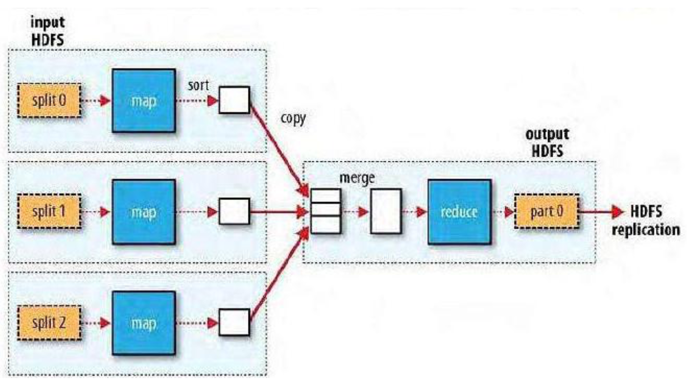

---
Matitle：	MapReduce简单介绍+代码实现
tag:	Hadoop
---

> 上一篇博客已经是一年前了...上一篇博客里简单介绍了Hadoop和HDFS
>
> 这篇我们就来谈谈MapReduce及相关代码实现吧！
>
> 照例附上[官网链接](http://hadoop.apache.org/docs/r1.0.4/cn/quickstart.html)

>Hadoop系列文章002

<head>
    <script src="https://cdn.mathjax.org/mathjax/latest/MathJax.js?config=TeX-AMS-MML_HTMLorMML" type="text/javascript"></script>
    <script type="text/x-mathjax-config">
        MathJax.Hub.Config({
            tex2jax: {
            skipTags: ['script', 'noscript', 'style', 'textarea', 'pre'],
            inlineMath: [['$','$']]
            }
        });
    </script>
</head>

## MapReduce 概述

Map/Reduce是一个高性能的分布式计算框架，用于对海量数据进行并行分析和处理。

Map/Reduce分为**Map(映射)**和**Reduce(化简)**两个阶段，是在HDFS存储数据的基础上，将一个较大的计算任务**(job)**分解成若干小任务**(task)**，每个小任务都由一个Map任务(task)来计算（这个Map尽量在数据所在节点上完成计算），然后再将每个Map的计算结果由一个或多个Reduce任务(task)合并，得到最终的结果。

概括来说就是比较常见的**“分治”**法，和快排里的分治，然后合并的思想是一样的！

举个🌰：如果现在的任务是计算`1+5+7  +3+4+9 +3+5+6=?` 那么这个计算过程在MapReduce里就是这样的：

```
Map:	1+5+7			3+4+9			3+5+6

Reduce:		13+16+14 
						|
					  43
```

Map/Reduce框架由一个单独的**master**`JobTracker`和每个集群节点一个**slave**`TaskTracker`共同组成，master负责调度一个作业的所有任务，这些任务分布在不同的slave上由master监控执行。



##MapReduce 编程思想 

> 通过上面的🌰，我们知道了MapReduce本质上就是普普通通的分治。但是...光是这样简单的了解好像还不太能够写代码哦..那么接下来看看编程思想吧！

MapReduce操作数据的最小单位是一个**键值对**，对没错，就是你想的那个**key-value**！我们在使用MapReduce模型的时候，第一步就要将数据抽象为key-value的形式，接下来map函数会以key-value作为输入，经过你写的map函数的处理，会生成一系列新的键值对作为中间结果输出到本地。然后MapReduc这个框架会自动将中间结果按照key做聚合，并将**key相同的数据**分发给reduce函数处理，reduce函数以同样的key和对应的value作为输入处理后产生另一系列的key-value作为输出。

最简单的map-reduce可以理解成，几个node按照自己分到的数据，按照你写的map的功能，将数据分成有规律的map-reduce然后几个node把自己的计算结果怼给负责reduce的node，这个reduce也是按照你写的reduce的功能将同样map的数据合并合并，之后输出新的map-reduce. 当然，整个过程的reduce其实可以执行多次。

这里一个注意的地方是：**reduce的输入类型必须和map的输出类型一致！！**，剩下的输入输出随意。

## 运行一下MapReduce例程WordCount吧！

WordCount可以统计输入的文件夹下的多个文档中每个单词的出现次数.

流程：

1. 启动YARN和jobhistory（关于这俩的介绍我们放在下一篇博客 或者是让我悄悄编辑一下这篇博客添加一下吧Orz）

   ```
   cd hadoop-x.x.x/sbin // 就是cd $HADOOP_HOME/sbin
   ./start-yarn.sh
   ./mr-jobhistory-daemon.sh start historyserver
   ```

2. 上传想要统计的本地文档到HDFS中

   ```
   hdfs dfs -mkdir -p /expr/wordcount/data
   hdfs dfs -put xxxxfilexxxx /expr/wordcount/data
   ```

3. 可以运行了

   ```
   cd hadoop-x.x.x/share/hadoop/mapreduce
   hadoop jar hadoop-mapreduce-examples-2.8.5.jar wordcount /expr/wordcount/data /expr/wordcount/output // 解释一下就是运行了example里的wordcount wordcount的输入在HDFS的/expr/wordcount/data中，输出结果在/expr/wordcount/output中（这个目录程序自动创建的
   ```

4. 查看结果

   ```
   现在/expr/wordcount/里是这样的：
   drwxr-xr-x   - xusy supergroup          0 2019-12-29 16:44 /expr/wordcount/data
   drwxr-xr-x   - xusy supergroup          0 2019-12-29 16:46 /expr/wordcount/output
   output里存的wordcount的结果,output里长这样
   -rw-r--r--   1 xusy supergroup          0 2019-12-29 16:46 /expr/wordcount/output/_SUCCESS
   -rw-r--r--   1 xusy supergroup         71 2019-12-29 16:46 /expr/wordcount/output/part-r-00000
   执行这个👉🏿hdfs dfs -cat /expr/wordcount/output/part-r-00000就可以看结果了
   ```

   可以在/data下面多传几个文档，一起被统计wordcount，哇真的好方便！

可以看看这个流程图加深印象


当然你也可以到上面存放例程的位置打开.jar-> WordCount.java看看源码，文章开头的官网链接中也有相关源码介绍。

Mapper👇🏼

```java
	public static class TokenizerMapper extends Mapper<Object, Text, Text, IntWritable> {		
			private final static IntWritable one = new IntWritable(1);
			private Text word = new Text();

			public void map(Object key, Text value, Context context ) throws IOException, InterruptedException {
	    		StringTokenizer itr = new StringTokenizer(value.toString());
	    		while (itr.hasMoreTokens()) {
	    			word.set(itr.nextToken());
	    			context.write(word, one);
	    		}
	   	 }
	}
```

Reducer👇🏼

```java
	public static class IntSumReducer extends Reducer<Text,IntWritable,Text,IntWritable> {
			private IntWritable result = new IntWritable();
		
			public void reduce(Text key, Iterable<IntWritable> values, Context context) throws IOException, InterruptedException {
				int sum = 0;
				for (IntWritable val : values) {
					sum += val.get();
				}
				result.set(sum);
				context.write(key, result);
	    	}
	}
```

## 自己写mapper和reducer类！

如果你打开看了wordcount看了源码的话..这里会更加清楚mapper和reducer class到底是按照啥流程写的，当然没看也没关系，我们一起总结一下这玩意到底咋写！

1. 首先，想用Map/Reduce框架，我们要先设置好这次作业Job的一些信息：

   ```java
   public static void main(String[] args)throws Exception{
     	//1.设置好HDFS的配置信息
     	Configuration conf = new Configuration();
     	String hdfs = "hdfs://xusy:9000"; //因为我用的本机搞的伪分布，我的master名字就是xusy,对应HDFS端口9000
     	conf.set("fs.default.name",hdfs);
       //2.设置好MapReduce的作业配置信息
     	String jobName = "xxxx";
     	Job job = Job.getInstance(conf, jobName);
     	job.setJarByClass(xxxx.class);
     	job.setMapperClass(yourMapper.class);
   		job.setCombinerClass(yourReducer.class);		
   		job.setReducerClass(yourReducer.class);
   		job.setOutputKeyClass(Text.class); //output
   		job.setOutputValueClass(IntWritable.class); 
     	//3.设置作业的输入输出路径
     	String dataDir = "xxxx"; //输入路径 可以是/xxxx/data
     	String outputDir = "xxxx"; //输出路径 /xxxx/output
     	Path inPath = new Path(hdfs + dataDir);
     	Path outPath = new Path(hdfs + outputDir);
     	FileInputFormat.addInputPath(job, inPath);
     	FileOutputFormat.setOutputPath(job, outPath);
     	//如果输出目录已存在则删除
     	FileSystem fs = FileSystem.get(conf);
     	if(fs.exists(outPath)){
         	fs.delete(outPath, true);
      	}
     	//4.运行作业
     	System.out.println("Job: " + jobName + "is running..."); //可选的输出啦~这样输出会更好看一些
     	if(job.waitForCompletion(true)){
         	System.out.println("success!");
         	System.exit(0);
       } else{
         	System.out.println("failed!");
         	System.exit(1);
       }
   }
   ```

2. 上面的job都设置好了之后，剩余的工作就是写你的Mapper和Reducer了

   ```java
   
   ```

   

